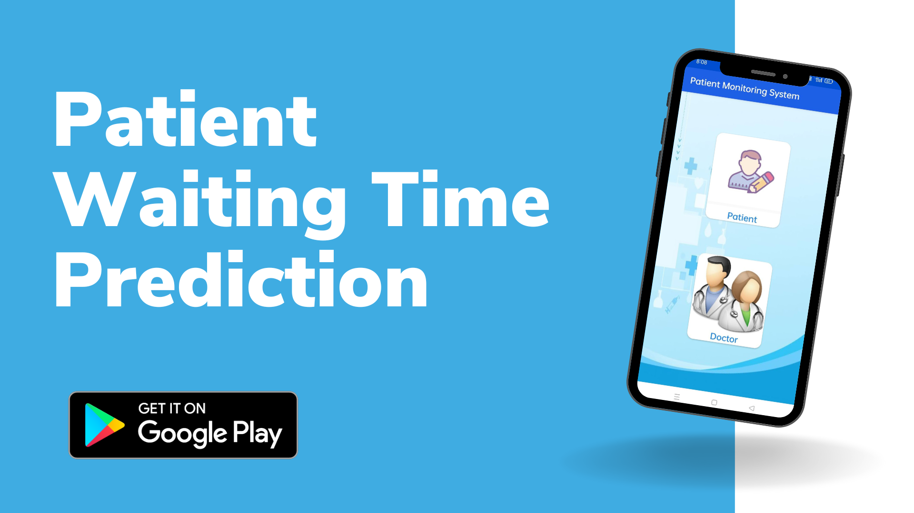
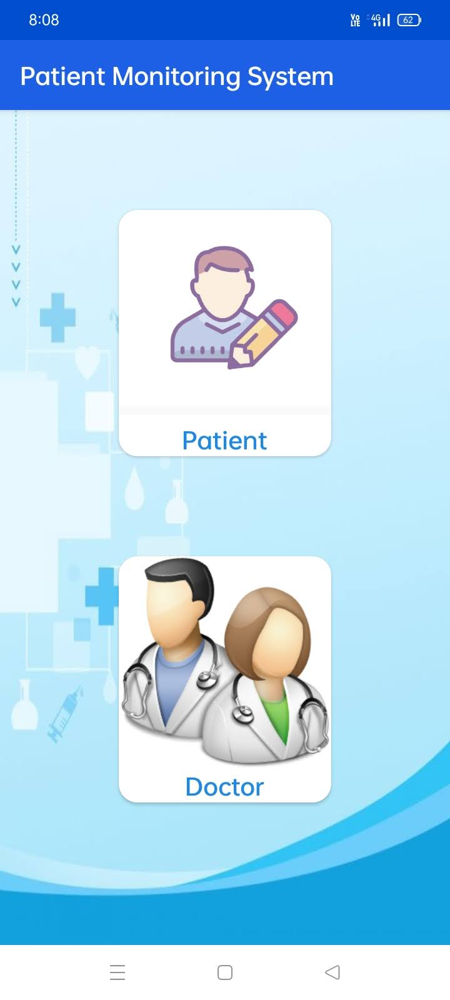
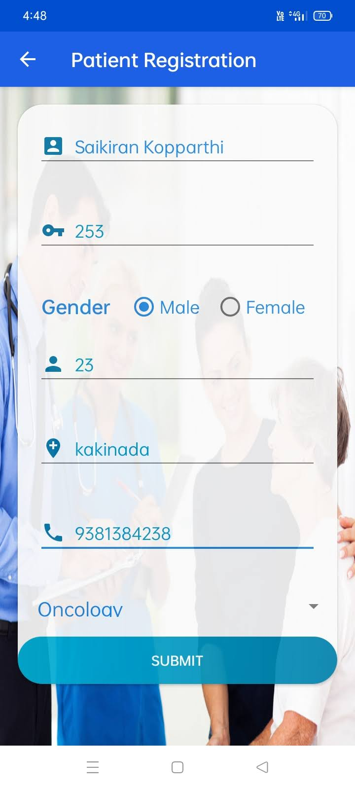
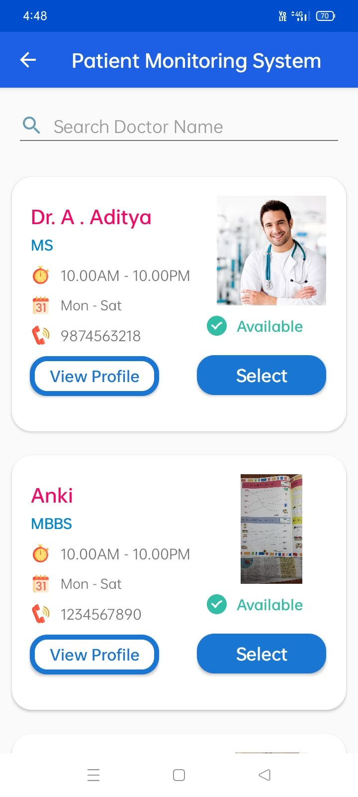
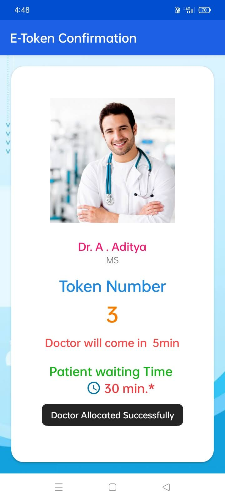
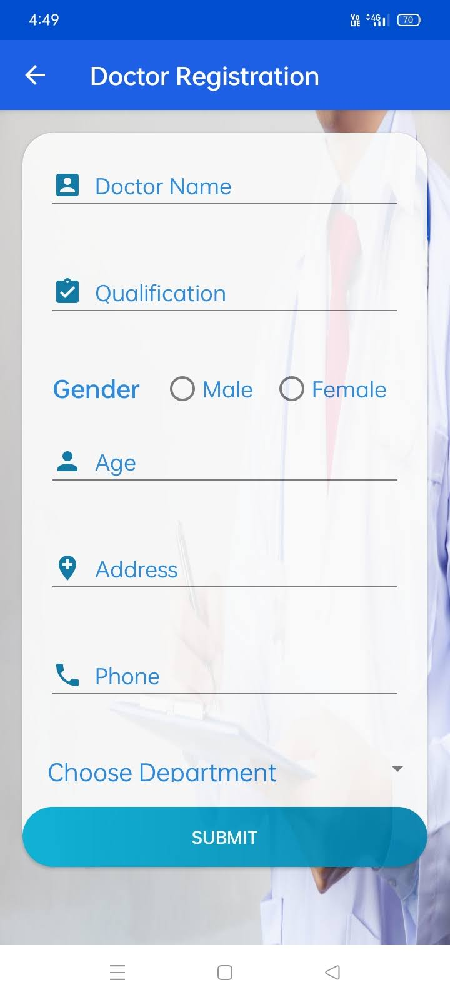
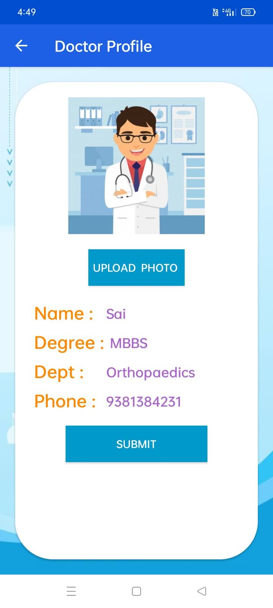

<h1 >Patient Waiting Time Prediction</h1> 
<h3><i>Say Goodbye to long waits !</i></h3>

  

 

 &nbsp;
 &nbsp;
 &nbsp;
 &nbsp;
 
  

<h3 align="center">
    🔹
    <a href="https://github.com/saikiran1224/Patient_Waiting_Time_Prediction/issues">Report Bug</a> &nbsp; &nbsp;
    🔹
    <a href="https://github.com/saikiran1224/Patient_Waiting_Time_Prediction/issues">Request Feature</a>
</h3>

 

## TL;DR
If you would like to use this application, fork the repository and link back to [saikiran1224](https://github.com/saikiran1224) for proper credits. Thanks in Advance! 

## 🧠 Motivation behind Developing this Application

Everyone of us once in a lifetime, there may be a case where we need to go to Hospital be it for check-up or either Consultation, etc. But have you waited for long time unknowingly when you will be called for scheduled visit to the Doctor. The time period between once you receive your payment recepit or the token, and the time when you will be called to the Doctor is so long and even no one can predict the exact amount of time you need to sit in the Waiting Hall. 

## Working of Patient Waiting Time Prediction

This application is a simple **Prototype** and is the mirror image of the real app once it gets deployed. The app provides platform for both Doctors and Patient. The application is developed in such a way that it can be purely managed by the Hospital Management. Once a new doctor arrives, Management will be adding the details of the doctor into the app starting from Name and ending with their Designation. 

The same way will be applied when a patient comes to Hospital where, details like Patient Name, and the problem they are facing will be taken and based on that concerned medical department doctors will be displayed. 

For example, I am doctor who got registered in the Dept. of Opthamology then if some patient comes with a Eye Problem, and selects Opthamology dept, all the doctors who are registered in this dept. will be displayed along with Availability, designation, etc. Based on that Patient will be given the option to choose their Doctor. 

Once Doctor is selected, major operations will be performed by the Backend like **Calculating approx. Waiting time for the User** and it **generates a Token Number** automatically and it will be showed to the Patient. This acts like a **Digital Receipt** to the User and avoid Paper.

## 👷🏼 Built With 

This application is initially developed for **Native Android users** and will be extended to iOS Users in coming future. Any Contributors are open if they are willing to contribute.  

This project was built using these technologies.

- Native Android
- Java
- Firebase
   - Authentication ( Email ID )
   - Realtime Database
   - Storage 
- Glide

## 🤩 Features

- Patients can know their approximate Waiting Time.
- Helps Hospitals to manage in a seamless way 
- Adhering to COVID guidelines, Patients are required not to wait for long times in Waiting Room
- Paper-free Digital Receipts are given 

## Contribute

This project is open for contributors and feel free to `fork` and make a `Pull Request` to the repo. If you feel any enhancements are required don't hesistate to open an issue.

## Screenshots 

<table>
 
 <tr>
   <td width="33.3%">&nbsp;</td>
   <td width="33.33%">&nbsp;</td>
   <td width="33.33%">&nbsp;</td>
 </tr>
 <tr>
   <td align="center">Home Page</td>
   <td align="center">Patient Registration</td>
   <td align="center">Choose Doctor </td>
 </tr>
 
 <tr>
   <td width="33.3%">&nbsp;</td>
   <td width="33.33%">&nbsp;</td>
   <td width="33.33%">&nbsp;</td>
 </tr>
 <tr>
   <td align="center">e-Receipt for Patients</td>
   <td align="center">Doctor Registration</td>
   <td align="center">Doctor Photo Upload</td>
 </tr>
  
</table>

 

## Show your support 

Follow me for more projects and dont forget to Give a ⭐ if you like this application!
